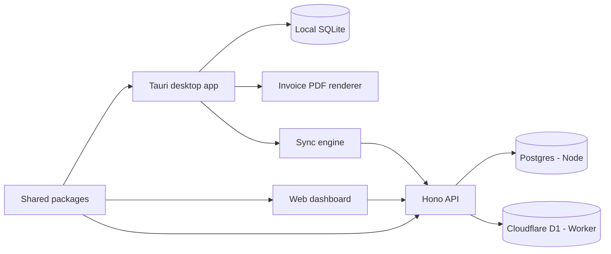

# Project Overview: Tickr

## Description

Tickr is a local-first freelancer time tracker with a Tauri desktop app, optional sync backend, lightweight web dashboard, client/project management, time tracking, reports, tasks, and PDF invoice export.

The project uses Spec-Driven Development (SDD): feature intent, plans, todos, and progress are tracked under `specs/` and kept aligned with implementation as features ship.

## Product Architecture



## Workspace Layout

| Component | Location | Purpose |
|-----------|----------|---------|
| Desktop app | `apps/desktop` | Tauri 2 + React desktop client, local SQLite, tray panel, global shortcuts, invoice export |
| API | `apps/api` | Hono sync/auth API for Node and Cloudflare Worker/D1 |
| Web app | `apps/web` | Lightweight synced dashboard |
| Shared DB | `packages/db` | Drizzle schemas for SQLite, Postgres, and D1-adjacent flows |
| Shared domain | `packages/shared` | Sync protocol, time helpers, money helpers |
| UI | `packages/ui` | Shared React primitives used by desktop/web |
| Invoice PDF | `packages/invoice-pdf` | `@react-pdf/renderer` invoice document template |
| SDD system | `.cursor/` | Cursor rules, commands, agents, skills, hooks, and sandbox configuration |

## Current Shipped Feature Specs

| Task ID | Scope | Status |
|---|---|---|
| `ttf-001` | Core Tickr time tracker, desktop workflow, API/Worker parity, web dashboard | Shipped |
| `ttf-002` | Richer client profiles, Claude-style tray QuickPanel, live menubar timer | Shipped |
| `ttf-003` | Invoice PDF export fix, Settings-backed invoice profile, redesigned PDF template | Shipped |

## Operational Notes

- Desktop data is local-first in SQLite through Tauri SQL.
- Optional sync uses the shared Zod sync protocol in `packages/shared`.
- Invoice profile data is stored in the existing desktop `settings` key/value table.
- Client profile fields added in `ttf-002` are reused by the invoice PDF in `ttf-003`.
- Tauri capabilities must include binary FS write permission for PDF export.

## SDD Workflow

| Flow | Commands | Use When |
|------|----------|----------|
| **Quick Planning** | `/brief` → `/evolve` → `/refine` | Small features and follow-up refinements |
| **Full Planning** | `/research` → `/specify` → `/plan` → `/tasks` → `/implement` | Complex features |
| **Parallel Execution** | `/sdd-full-plan` → `/execute-parallel` | Roadmap-style feature sets |

## Spec Directory Structure

```
specs/
├── 00-overview.md              # This file
├── index.md                    # Navigation and status
├── active/[task-id]/           # Active or recently shipped feature specs
│   ├── feature-brief.md        # Quick Planning output
│   ├── research.md             # /research output
│   ├── spec.md                 # /specify output
│   ├── plan.md                 # /plan output
│   ├── tasks.md                # /tasks output
│   ├── todo-list.md            # /implement creates this
│   └── progress.md             # Development tracking
├── todo-roadmap/[project-id]/  # /sdd-full-plan output
│   ├── roadmap.json            # DAG-based task graph
│   ├── roadmap.md              # Human-readable view
│   └── tasks/                  # Individual task files
├── completed/                  # Delivered features (moved from active/)
└── backlog/                    # Future features
```

## Links

- [Feature Index](index.md)
- [Agent Manual](../.cursor/commands/_shared/agent-manual.md)
- [System Rule](../.cursor/rules/sdd-system.mdc)

---
**Version:** SDD 5.0 | **Requires:** Cursor 2.5+
