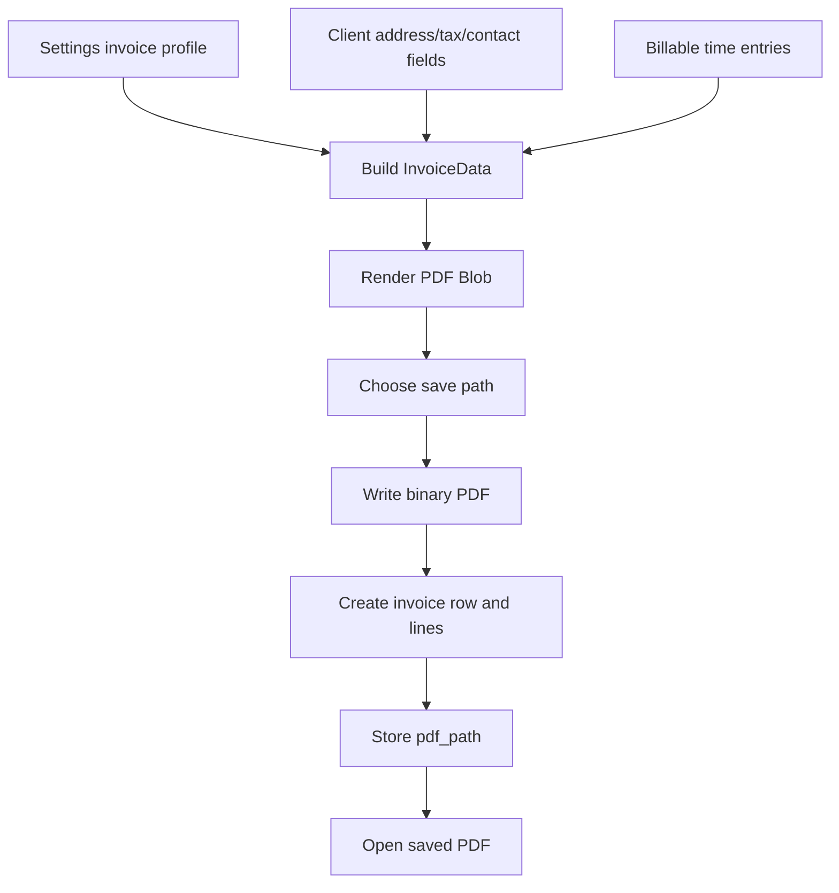

# Technical Plan: Invoice PDF export + branded invoice profile

**Task ID:** ttf-003
**Status:** Shipped
**Based on:** [feature-brief.md](feature-brief.md)
**Depends on:** ttf-001 invoice flow, ttf-002 richer client profile fields

---

## 1. Problem

The invoice flow rendered a PDF and showed a save dialog, but the saved file did not appear. The implementation wrote binary PDF bytes with `@tauri-apps/plugin-fs.writeFile`, while the Tauri capability only allowed `fs:allow-write-text-file`.

The flow also created the invoice row before writing the PDF, so a write failure could leave an invoice record with a broken or missing `pdf_path`.

Separately, the invoice PDF lacked the details a freelancer needs on a client-facing invoice: reusable sender business details, sender/client tax IDs, payment instructions, logo, and signature.

## 2. Architecture Decisions

| Decision | Choice | Rationale |
|---|---|---|
| PDF file write permission | Add `fs:allow-write-file` | Binary `Uint8Array` writes require the binary write command permission, not only text writes. |
| Invoice row timing | Write PDF before creating invoice row | Avoids persistent invoice records when export fails or the user cancels. |
| Invoice profile storage | Existing local `settings` key/value table | Keeps the change local-first and avoids a schema migration. |
| Logo/signature storage | PNG data URLs in settings | Works with `@react-pdf/renderer`; preserves signature transparency. |
| Payment details | Generic payment instructions textarea | Avoids Paper.id-specific branding while supporting bank, transfer, and wallet instructions. |

## 3. Data And Settings

New settings keys:

- `owner_address`
- `owner_tax_id`
- `owner_logo_data`
- `owner_signature_data`
- `owner_payment_instructions`

Existing keys reused:

- `owner_name`
- `owner_email`

No SQL migration is needed because all values live in `settings`.

## 4. Generation Flow

If the user cancels the save dialog, no invoice row is created. If file writing fails, the error is surfaced near the Generate invoice button and no invoice row is created.

## 5. PDF Contract

`InvoiceData` now includes:

- `from.tax_id`
- `from.logo_data`
- `to.address`
- `to.tax_id`
- optional `to.phone` and `to.website`
- `payment_instructions`
- `signature_data`
- `signature_name`

## 6. PDF Design

The redesigned PDF uses:

- Header with logo, sender name/contact, invoice number, issued date, and due date.
- Sender and bill-to blocks with address and tax IDs.
- Strong line-item table with clearer spacing, separators, and numeric alignment.
- Totals hierarchy with a prominent total due.
- Payment instructions section.
- Signature block with uploaded signature image or printed sender name fallback.

## 7. Verification

- `pnpm --filter @ttf/invoice-pdf typecheck`
- `pnpm --filter @ttf/desktop typecheck`
- `cargo check --manifest-path apps/desktop/src-tauri/Cargo.toml`
- `pnpm -w lint`
- `ReadLints` on touched TS/TSX files

Manual verification target: generate an invoice to Desktop or Downloads, confirm the PDF file exists, opens, and the saved invoice row stores `pdf_path`.
