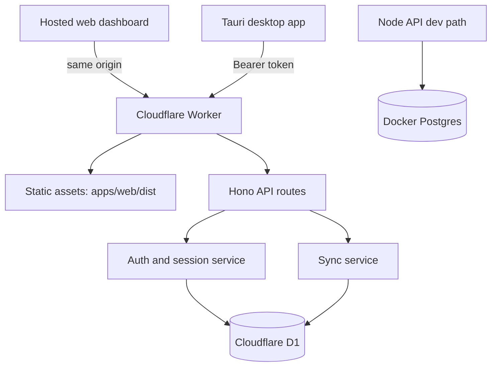

# Technical Plan: Cloudflare deployability + web auth hardening

**Task ID:** ttf-004
**Status:** Shipped
**Based on:** [feature-brief.md](feature-brief.md)
**Depends on:** ttf-001 API/sync/web foundation, ttf-002 richer client data, ttf-003 invoice PDF work

---

## 1. Overview

Tickr already has the basic pieces for hosted deployment:

- `apps/web` is a Vite React dashboard.
- `apps/api` is a Hono API with Node/Postgres and Worker/D1 entry points.
- `infra/wrangler/wrangler.jsonc` exists.
- The desktop app can sync to a configured backend URL with a token.

The deploy path is not yet dead-simple:

- Wrangler config is minimal and not environment-ready.
- Web assets are not tied into the Worker deploy.
- D1 schema setup is request-time and should become explicit migrations.
- Web login stores bearer tokens in `localStorage`.
- CORS defaults are too broad for production.
- There is no one-command preflight/deploy workflow.

The recommended future architecture is a single Cloudflare Worker that serves both static web assets and the Hono API, backed by D1.

## 2. Current Files To Review During Implementation

- `package.json`
- `pnpm-workspace.yaml`
- `turbo.json`
- `.env.example`
- `.gitignore`
- `README.md`
- `infra/wrangler/wrangler.jsonc`
- `infra/docker/docker-compose.yml`
- `apps/api/package.json`
- `apps/api/src/app.ts`
- `apps/api/src/worker.ts`
- `apps/api/src/index.node.ts`
- `apps/api/src/routes/auth.ts`
- `apps/api/src/routes/sync.ts`
- `apps/api/src/lib/jwt.ts`
- `apps/api/src/lib/bearer.ts`
- `apps/api/src/lib/runtime.ts`
- `apps/api/src/lib/store.ts`
- `apps/api/src/lib/node-store.ts`
- `apps/api/src/lib/worker-store.ts`
- `apps/api/src/lib/db.ts`
- `apps/web/package.json`
- `apps/web/vite.config.ts`
- `apps/web/src/App.tsx`
- `packages/db/src/sqlite`
- `packages/db/src/postgres`
- `packages/db/src/d1`
- `packages/db/migrations/postgres`
- `packages/shared/src/sync.ts`

## 3. Architecture



### Routing

- `/auth/*` runs through Hono.
- `/sync/*` runs through Hono.
- `/health` runs through Hono.
- All other paths serve the Vite SPA from static assets.
- SPA fallback is enabled for client-side routes.

### Deployment Target

Use Workers Static Assets, not Cloudflare Pages, for the default deploy path. This keeps deployment in one Wrangler config and avoids split-origin CORS for hosted web login.

## 4. Components

| Component | Responsibility | Dependencies | Future files |
|---|---|---|---|
| Wrangler config | Single source of truth for Worker, assets, D1, environments, secrets, and observability | Wrangler v4, D1 database IDs, web build output | `infra/wrangler/wrangler.jsonc` |
| Web build | Produce static SPA assets for Worker Static Assets | Vite, React, same-origin API defaults | `apps/web/*` |
| Worker entry | Run Hono API and serve static assets | Wrangler assets binding, Hono app, generated Worker types | `apps/api/src/worker.ts` |
| Hono app | Auth, sync, health, CORS, and security middleware | Runtime store abstraction, auth helpers, D1/Node stores | `apps/api/src/app.ts` |
| Auth service | Password login, cookie sessions for web, bearer compatibility for desktop | User/session tables, JWT/session secret, password hashing | `apps/api/src/routes/auth.ts`, `apps/api/src/lib/*` |
| D1 migrations | Explicit Cloudflare schema setup | Current Worker schema, sync tables, session table | `packages/db/migrations/d1/*.sql` |
| Worker types | Generated binding types from Wrangler config | `wrangler types`, final binding names | `apps/api/src/worker-configuration.d.ts` |
| Deploy scripts | Preflight, migration, dev, dry-run deploy, deploy, and tail commands | Root/package scripts, Wrangler config path | root `package.json`, `apps/api/package.json` |
| Deploy docs | Step-by-step future deployment guide | Final scripts, env/secret decisions, D1 setup flow | `README.md` or `docs/deploy-cloudflare.md` |

## 5. Technology Stack

| Technology | Keep / Add / Defer | Rationale |
|---|---|---|
| Cloudflare Workers | Keep | Already supported by `apps/api/src/worker.ts`; gives one deploy target for API and web assets. |
| Workers Static Assets | Add | Serves `apps/web/dist` from the same Worker origin, simplifying cookies and CORS. |
| Cloudflare D1 | Keep | Existing Worker store already targets D1; good fit for small local-first sync metadata. |
| Hono | Keep | Current API framework works across Node and Workers. |
| Vite React SPA | Keep | Existing `apps/web` dashboard can deploy as static assets. |
| Wrangler v4 | Add/update | Current Cloudflare guidance prefers modern JSONC config, Worker Static Assets, dry-run validation, and generated types. |
| D1 migrations | Add | Replaces request-time schema mutation with explicit, repeatable deployment steps. |
| Generated Worker types | Add | Prevents binding drift between `wrangler.jsonc` and `apps/api/src/worker.ts`. |
| Node/Postgres/Docker | Keep as secondary | Useful for local/self-host development, but not the default dead-simple Cloudflare path. |
| Cloudflare Pages | Defer | Adds split deployment/origin complexity without a current benefit. |
| KV/R2/Queues/Durable Objects/Workflows/Hyperdrive | Defer | No current requirement needs these services. |

## 6. Needed vs Not Needed

### Needed

- Worker Static Assets config for `apps/web/dist`.
- `env.staging` and `env.production` in Wrangler.
- D1 database bindings per environment.
- Required secret declaration for `JWT_SECRET` or a renamed auth/session secret.
- `.dev.vars.example` for local Worker dev.
- D1 migrations instead of request-time schema creation.
- `pnpm cf:check`, `wrangler types --check`, and dry-run deploy scripts.
- Web login moved away from `localStorage` bearer tokens.
- Strict CORS for desktop/dev origins.
- Security headers for hosted web responses.

### Not Needed Now

- Cloudflare Pages project.
- Pages Functions.
- KV.
- R2.
- Queues.
- Durable Objects.
- Workflows.
- Hyperdrive.
- Cloudflare Access as the default app auth system.
- Magic links without an email provider.
- External OAuth.

## 7. API And Auth Design

### Current Auth

- `POST /auth/register` returns `{ token, user }`.
- `POST /auth/login` returns `{ token, user }`.
- `GET /auth/me` requires a bearer token.
- Web stores the token in `localStorage`.
- Desktop stores backend URL and token in local settings.

### Recommended Default

- Keep bearer auth for desktop sync.
- Add `HttpOnly`, `Secure`, `SameSite=Lax` or `SameSite=Strict` cookie sessions for hosted web login.
- Deploy web and API same-origin so cookies work without broad CORS.
- Make `/auth/me` accept either cookie session or bearer token.
- Keep `/sync/push` and `/sync/pull` bearer-compatible for desktop.
- Add `/auth/logout` to clear the cookie and revoke the session.
- Add a future “create desktop token” flow if hosted web should provision desktop sync tokens.

### Why Not Cloudflare Access By Default

Cloudflare Access is excellent for protecting a private dashboard, but it does not replace Tickr's app-level user model, data isolation, desktop sync tokens, or future account management.

### Why Not Magic Links By Default

Magic links require an email provider, deliverability work, token tables, rate limits, and callback UX. They are a good later feature but not necessary for a dead-simple first deploy.

## 8. Data And Infra Model

D1 should become migration-driven.

Future D1 migrations should include:

- `users`
- `sessions`
- `clients`
- `projects`
- `tags`
- `tasks`
- `time_entries`
- `entry_tags`
- `invoices`
- `invoice_lines`
- `recurring_invoices`
- indexes for sync pull access, especially `(user_id, updated_at)` where useful

Implementation should remove or sharply limit schema mutation inside request handling in `apps/api/src/lib/worker-store.ts`.

## 9. Recommended Wrangler Shape

```jsonc
{
  "name": "tickr",
  "main": "../../apps/api/src/worker.ts",
  "compatibility_date": "2026-04-27",
  "compatibility_flags": ["nodejs_compat"],
  "assets": {
    "directory": "../../apps/web/dist",
    "binding": "ASSETS",
    "not_found_handling": "single-page-application",
    "run_worker_first": true
  },
  "secrets": {
    "required": ["JWT_SECRET"]
  },
  "observability": {
    "enabled": true,
    "head_sampling_rate": 1
  },
  "d1_databases": [
    {
      "binding": "DB",
      "database_name": "tickr-prod",
      "database_id": "REPLACE_WITH_PROD_D1_ID",
      "migrations_dir": "../../packages/db/migrations/d1"
    }
  ],
  "env": {
    "staging": {
      "name": "tickr-staging",
      "vars": {
        "APP_ENV": "staging",
        "CORS_ORIGIN": "http://localhost:1420"
      },
      "d1_databases": []
    },
    "production": {
      "name": "tickr",
      "vars": {
        "APP_ENV": "production",
        "CORS_ORIGIN": "https://tickr.example.com"
      },
      "d1_databases": []
    }
  }
}
```

Wrangler environment bindings are not inherited, so staging and production must define their own D1 bindings and vars explicitly.

## 10. Security Considerations

### Sessions And Tokens

- Do not store web auth tokens in `localStorage`.
- Use `HttpOnly`, `Secure`, and `SameSite` cookies for browser sessions.
- Store only hashed opaque session tokens in D1/Postgres.
- Require at least 32 random bytes for production auth secrets.
- Keep desktop bearer/API-token compatibility.
- Prefer revocable desktop tokens later instead of long-lived JWT-only tokens.

### Passwords

- Current `bcryptjs` cost should be benchmarked on Workers.
- Keep the existing approach if latency is acceptable.
- Revisit Worker-friendly hashing only if login/register becomes too slow.

### CORS And CSRF

- Same-origin hosted web should not need broad CORS.
- Desktop and local dev origins should be explicit.
- Cookie-authenticated mutations should rely on same-origin deployment and `SameSite=Lax/Strict`; add a CSRF token if cross-origin cookie credentials are supported later.

### Data Isolation

- Every sync query must enforce `user_id`.
- Reject or overwrite any incoming `user_id` from clients.
- Add tests for cross-user read/update attempts.

### Headers And XSS

- Add CSP/security headers for Worker-served web responses.
- Avoid `dangerouslySetInnerHTML` for synced/client text.
- Keep React's default escaping.

### Registration Abuse

- Start with `REGISTRATION_MODE` gated registration:
  - `open`,
  - `first-user`, or
  - `disabled`.
- Add Turnstile/rate limiting only if public signup becomes a goal.

### Secrets And Logs

- Never put `JWT_SECRET` in `vars`.
- Ignore all `.dev.vars*` files; commit only examples.
- Do not log bearer tokens, cookies, passwords, or sync payloads.
- Prefer structured logs with route, status, request id, and non-PII identifiers.

## 11. Performance Targets

| Area | Target | Notes |
|---|---:|---|
| Hosted web shell | First static response served from Cloudflare edge cache | Worker Static Assets should keep the SPA shell fast and globally cached. |
| API health check | p95 under 100 ms at the edge, excluding cold starts | `/health` should not touch D1. |
| Auth login/register | p95 under 750 ms in staging | Password hashing dominates; benchmark `bcryptjs` on Workers before changing algorithms. |
| Sync pull/push | p95 under 1.5 s for typical freelancer datasets | Typical payloads should be small; use `(user_id, updated_at)` indexes for pull paths. |
| D1 migrations | Explicit pre-deploy step, no request-time migration latency | First real user request should not initialize schema. |
| Worker bundle | Stay below Cloudflare Worker limits with room for growth | Avoid adding unnecessary SDKs or auth providers in this phase. |

## 12. DX And Deployment Workflow

Recommended future scripts:

```bash
pnpm cf:check
pnpm cf:types
pnpm cf:dev
pnpm cf:migrate:local
pnpm cf:migrate:staging
pnpm cf:deploy:dry
pnpm cf:deploy:staging
pnpm cf:tail:staging
```

Recommended future command shape:

```bash
pnpm --filter @ttf/web build
pnpm --filter @ttf/api cf:check
pnpm --filter @ttf/api exec wrangler types -c ../../infra/wrangler/wrangler.jsonc src/worker-configuration.d.ts
pnpm --filter @ttf/api exec wrangler dev -c ../../infra/wrangler/wrangler.jsonc --local
pnpm --filter @ttf/api exec wrangler d1 create tickr-staging
pnpm --filter @ttf/api exec wrangler d1 migrations apply tickr-staging --local -c ../../infra/wrangler/wrangler.jsonc
pnpm --filter @ttf/api exec wrangler d1 migrations apply tickr-staging --remote -c ../../infra/wrangler/wrangler.jsonc --env staging
pnpm --filter @ttf/api exec wrangler deploy -c ../../infra/wrangler/wrangler.jsonc --env staging --dry-run
pnpm --filter @ttf/api exec wrangler deploy -c ../../infra/wrangler/wrangler.jsonc --env staging
```

Secret setup:

```bash
openssl rand -hex 32 | pnpm --filter @ttf/api exec wrangler secret put JWT_SECRET -c ../../infra/wrangler/wrangler.jsonc --env staging
```

## 13. Implementation Phases

### Phase 1 — Wrangler foundation

- Upgrade Wrangler to v4.
- Add Worker Static Assets config.
- Add staging and production environments.
- Add observability config.
- Add required secrets declaration.
- Add generated Worker types.
- Add root/package scripts.
- Update `.gitignore` and env examples.

### Phase 2 — D1 migrations

- Create `packages/db/migrations/d1/0000_initial.sql`.
- Include the session table and all sync columns from the current Worker schema.
- Configure `migrations_dir`.
- Stop relying on request-time schema creation.

### Phase 3 — Worker/web integration

- Build `apps/web` before deploy.
- Configure the Worker to serve static assets.
- Ensure API paths run Worker-first.
- Make hosted web same-origin by default, with no required manual API URL.

### Phase 4 — Web auth hardening

- Add cookie session support.
- Keep bearer compatibility for desktop.
- Add logout.
- Replace web `localStorage` token flow with cookie-backed login and `/auth/me`.

### Phase 5 — Security and DX polish

- Tighten CORS.
- Add CSP and security headers.
- Add registration gating.
- Add safe structured logging.
- Write Cloudflare deploy docs.

## 14. Testing And Verification

Preflight:

```bash
pnpm typecheck
pnpm --filter @ttf/web build
pnpm --filter @ttf/api typecheck
pnpm cf:check
pnpm --filter @ttf/api exec wrangler types --check -c ../../infra/wrangler/wrangler.jsonc
```

Worker/D1:

- Apply migrations locally.
- Register first user.
- Login from web and confirm cookie is `HttpOnly`.
- Pull sync snapshot.
- Push from desktop with bearer token.
- Confirm user A cannot read or update user B rows.
- Run dry-run deploy before real deploy.

Manual E2E:

- Node/Postgres dev path still works.
- Cloudflare local Worker path works.
- Hosted web path works without manually entering an API URL.
- Desktop can sync against the hosted Worker URL.

## 15. Risks

| Risk | Probability | Impact | Mitigation |
|---|---:|---:|---|
| D1 schema drifts from SQLite/Postgres | Medium | High | Use explicit D1 migrations and a schema checklist. |
| Cookie sessions introduce CSRF concerns | Medium | Medium | Same-origin deploy, `SameSite` cookies, add CSRF token if cross-origin credentials appear. |
| `bcryptjs` is too slow on Workers | Medium | Medium | Benchmark login/register in staging before changing hashing strategy. |
| Request-time D1 migrations hide deploy mistakes | High | Medium | Move schema setup to Wrangler D1 migrations. |
| Public registration abuse | Medium | Medium | First-user-only or env-gated registration initially. |
| Wrangler env drift | Medium | Medium | Duplicate non-inheritable bindings explicitly and validate with `pnpm cf:check`. |

## 16. Open Questions

- Should production use `app.tickr.example` or a different custom domain?
- Should initial registration be public, first-user-only, or disabled after bootstrap?
- Should desktop tokens remain JWTs or become revocable API tokens stored in `sessions`?
- Should Docker/Postgres stay equally documented as a self-hosted path, or remain dev/local only?
- Should the first deployment use `workers.dev` or require a custom domain from day one?
